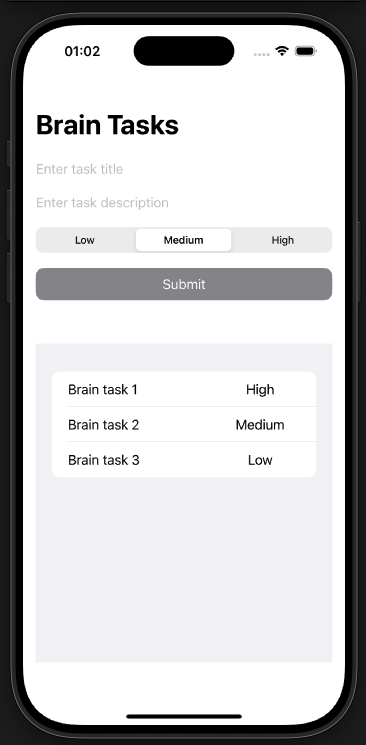
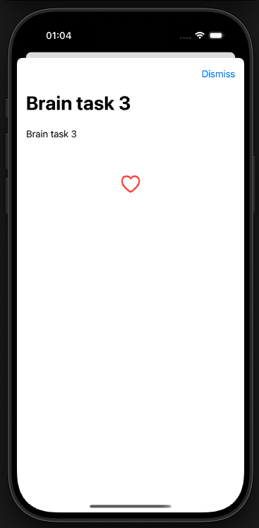
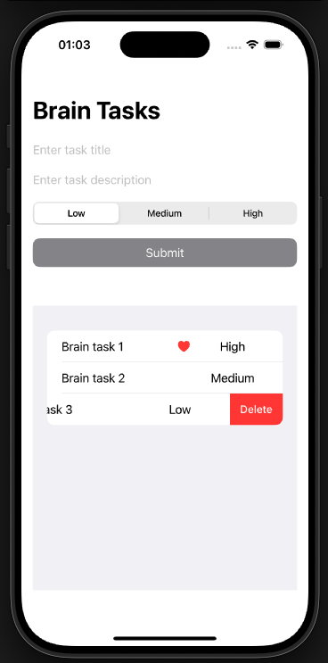

# BrainDump
BrainDump iOS app covering:

  -  SwiftUI – Declarative UI framework for building modern iOS apps.
  -  MVC Architecture – Code structured into Model, View, and Controller layers.
  -  Core Data – Framework for local data persistence and management.
  -  E2E Testing – Validating the entire app flow from start to finish.

📌 Note: No external dependencies – Just download and build.

📸 Screenshots

<table>
  <tr>
    <td></td>
    <td></td>
    <td></td>
  </tr>
</table>
